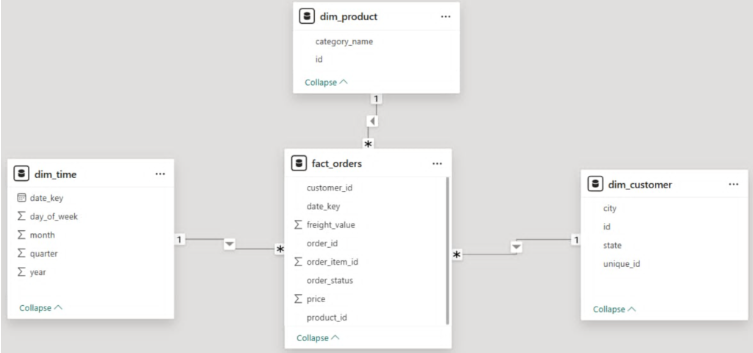

# 🛒 BTL-BI-EcommerceDashboard

Dự án Xây dựng Hệ thống Báo cáo Thông minh (Business Intelligence Dashboard) phân tích hiệu năng bán hàng E-Commerce sử dụng dữ liệu thương mại điện tử **Olist (Brazil)**. Dự án được phát triển bởi **Team 14** cho học phần Quản trị nghiệp vụ thông minh.

---

## 📌 Project Overview (Tổng quan dự án)
Dự án tập trung vào việc thu thập, làm sạch, thiết kế kho dữ liệu (Data Warehouse) theo mô hình hình sao (Star Schema), thực hiện quy trình ETL tự động và trực quan hóa dữ liệu trên Power BI Desktop. Từ đó cung cấp cái nhìn toàn diện về:
* Hiệu suất doanh thu và số lượng đơn hàng theo thời gian.
* Phân bố địa lý của khách hàng và hành vi mua sắm.
* Danh mục sản phẩm bán chạy nhất.
* Trạng thái và thời gian xử lý đơn hàng.

---

## 🏗️ Architecture & Star Schema (Kiến trúc & Mô hình hình sao)

### Luồng Dữ Liệu (ETL Workflow)
1. **Extract**: Đọc dữ liệu thô từ các file CSV của Kaggle trong thư mục `raw_data` / `archive`.
2. **Transform**: Làm sạch dữ liệu, chuẩn hóa kiểu dữ liệu, dịch danh mục sản phẩm từ tiếng Bồ Đào Nha sang tiếng Anh, lọc các trường cần thiết và loại bỏ trùng lặp.
3. **Load**: Xuất file CSV sạch ra thư mục `BI` đồng thời tự động nạp dữ liệu vào cơ sở dữ liệu **PostgreSQL**.

### Mô hình hình sao (Star Schema)
Dưới đây là thiết kế mô hình dữ liệu (gồm 1 bảng Fact và 3 bảng Dimension) được cấu hình trong Power BI / Database:



* **Dim_Customer**: Quản lý thông tin khách hàng (vị trí địa lý thành phố, bang).
* **Dim_Product**: Quản lý thông tin sản phẩm (đã dịch tên danh mục sang tiếng Anh).
* **Dim_Time**: Chi tiết hóa các chiều thời gian (năm, quý, tháng, ngày trong tuần).
* **Fact_Orders**: Bảng dữ kiện chứa doanh thu (price), phí vận chuyển (freight_value), giờ đặt hàng và trạng thái đơn hàng.

---

## 📂 Project Structure (Cấu trúc thư mục)

```text
├── BI/                          # Chứa các file dữ liệu sạch sau ETL (CSV)
│   ├── Dim_Customer_Clean.csv
│   ├── Dim_Product_Clean.csv
│   ├── Dim_Time_Clean.csv
│   └── Fact_Orders_Clean.csv
├── raw_data/                    # Thư mục chứa dữ liệu thô đầu vào (CSV)
│   ├── olist_customers_dataset.csv
│   ├── olist_products_dataset.csv
│   ├── olist_orders_dataset.csv
│   ├── olist_order_items_dataset.csv
│   └── product_category_name_translation.csv
├── DBQueries.sql                # Script SQL tạo Database và cấu trúc bảng (DDL)
├── ETL pipeline.ipynb           # Jupyter Notebook thực hiện pipeline ETL (Khuyên dùng)
├── ETL pipeline.py              # Script Python chạy ETL truyền thống
├── BI-EcormmerceDashboard.pbix # File thiết kế Báo cáo Power BI Desktop
├── project_summary.md           # Tài liệu tóm tắt chi tiết nghiệp vụ dự án
└── README.md                    # Hướng dẫn dự án này
```

---

## ⚙️ Technologies Used (Các công nghệ sử dụng)
* **Ngôn ngữ lập trình**: Python
* **Thư viện xử lý dữ liệu**: Pandas, SQLAlchemy
* **Hệ quản trị cơ sở dữ liệu**: PostgreSQL
* **Công cụ trực quan hóa**: Power BI Desktop
* **Môi trường chạy**: Jupyter Notebook / VS Code

---

## 🚀 Getting Started & Installation (Hướng dẫn chạy dự án)

### 1. Cài đặt môi trường Python
Yêu cầu máy tính đã cài đặt Python 3.x. Tạo môi trường ảo và cài đặt các thư viện cần thiết:
```bash
# Tạo môi trường ảo (Khuyến khích)
python -m venv .venv
.venv\Scripts\activate

# Cài đặt các thư viện cần thiết
pip install pandas sqlalchemy psycopg2
```

### 2. Thiết lập Database trong PostgreSQL
1. Mở hệ quản trị PostgreSQL (ví dụ pgAdmin hoặc kết nối qua CLI).
2. Tạo cơ sở dữ liệu mới tên là: `Data-warehouse-Ecommerce`.
3. Chạy toàn bộ script trong file [DBQueries.sql](DBQueries.sql) để khởi tạo các bảng `Dim_Customer`, `Dim_Product`, `Dim_Time`, và `Fact_Orders` cùng các ràng buộc khóa chính, khóa ngoại.

### 3. Thực thi Pipeline ETL
Bạn có thể lựa chọn chạy bằng một trong hai cách:

* **Cách 1 (Khuyên dùng - Trực quan)**: Mở Jupyter Notebook [ETL pipeline.ipynb](ETL%20pipeline.ipynb) và chạy từng cell để theo dõi quá trình biến đổi, xuất file và nạp vào DB.
* **Cách 2**: Chạy trực tiếp file python script bằng dòng lệnh:
  ```bash
  python "ETL pipeline.py"
  ```

---

## 📊 Connecting to Power BI (Hướng dẫn kết nối Power BI)

Sau khi hoàn thành chạy ETL, dữ liệu đã nằm sẵn trong PostgreSQL và thư mục `BI`. Bạn có thể mở file [BI-EcormmerceDashboard.pbix](BI-EcormmerceDashboard.pbix) bằng Power BI Desktop và thiết lập kết nối như sau:

### Phương án 1: Kết nối trực tiếp Database PostgreSQL (Khuyên dùng)
* **Server/Host**: `localhost` (hoặc IP server)
* **Port**: `5432`
* **Database**: `Data-warehouse-Ecommerce`
* **Username**: `postgres`
* **Password**: `12345` (hoặc mật khẩu Postgres của bạn, cập nhật lại trong ETL script nếu thay đổi)
* *Lưu ý*: Chọn chế độ kết nối **Import** để đảm bảo hiệu năng tối ưu nhất cho mô hình Star Schema khi tính toán hàm DAX.