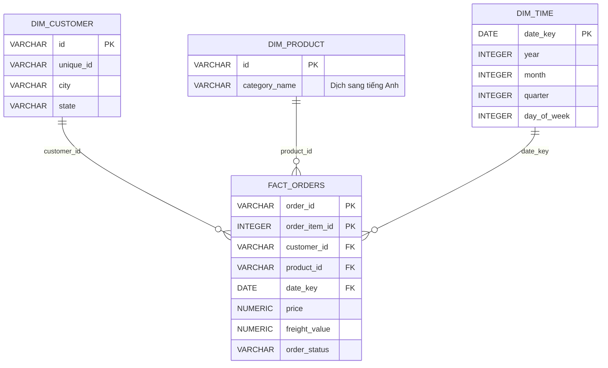

# Tóm tắt Dự án BI E-Commerce (Team 14)

Tài liệu này tóm tắt toàn bộ trạng thái hiện tại của dự án để cung cấp ngữ cảnh đầy đủ cho việc kết nối cơ sở dữ liệu (Database) với **Power BI Desktop** và xây dựng Báo cáo/Dashboard.

---

## 1. Tổng quan Dữ liệu & Nghiệp vụ
Dự án sử dụng bộ dữ liệu thương mại điện tử **Olist (Brazil)** gồm các thông tin về khách hàng, sản phẩm, đơn hàng và chi tiết sản phẩm trong đơn hàng. 

Mục tiêu là xây dựng một **Data Warehouse (Star Schema)** đơn giản nhằm phục vụ phân tích hiệu năng bán hàng, doanh thu, phân bố khách hàng địa lý và thời gian đặt hàng.

---

## 2. Kiến trúc Data Warehouse (Star Schema)
Dữ liệu đã được chuẩn hóa và ánh xạ từ các file nguồn thô sang mô hình hình sao (Star Schema) gồm 1 bảng Fact và 3 bảng Dimension:

---

## 3. Các thành phần đã triển khai trong Project

### A. Dữ liệu thô (Raw Data)
Nằm trong thư mục [archive/](file:///c:/Users/huyle/OneDrive/Desktop/64GB_child_po/N%C4%83m%204%20%28k%C3%AC%202%29/Qu%E1%BA%A3n%20tr%E1%BB%8B%20nghi%E1%BB%87p%20v%E1%BB%A5%20th%C3%B4ng%20minh/BI-Team14-Ecom/archive):
* `olist_customers_dataset.csv`: Thông tin khách hàng.
* `olist_products_dataset.csv`: Thông tin sản phẩm thô (danh mục tiếng Bồ Đào Nha).
* `olist_orders_dataset.csv`: Trạng thái đơn hàng, mốc thời gian mua hàng.
* `olist_order_items_dataset.csv`: Chi tiết sản phẩm trong đơn hàng (giá, phí vận chuyển).
* `product_category_name_translation.csv`: Bảng ánh xạ dịch tên danh mục sản phẩm từ tiếng Bồ Đào Nha sang tiếng Anh.

### B. Kịch bản ETL Pipeline (`ETL pipeline.ipynb` / `ETL pipeline.py`)
File Jupyter Notebook [ETL pipeline.ipynb](file:///c:/Users/huyle/OneDrive/Desktop/64GB_child_po/N%C4%83m%204%20%28k%C3%AC%202%29/Qu%E1%BA%A3n%20tr%E1%BB%8B%20nghi%E1%BB%87p%20v%E1%BB%A5%20th%C3%B4ng%20minh/BI-Team14-Ecom/ETL%20pipeline.ipynb) (hoặc file Python [ETL pipeline.py](file:///c:/Users/huyle/OneDrive/Desktop/64GB_child_po/N%C4%83m%204%20%28k%C3%AC%202%29/Qu%E1%BA%A3n%20tr%E1%BB%8B%20nghi%E1%BB%87p%20v%E1%BB%A5%20th%C3%B4ng%20minh/BI-Team14-Ecom/ETL%20pipeline.py)) thực hiện các bước:
1. **Đọc dữ liệu thô** bằng thư viện `pandas`.
2. **Transform (Biến đổi)**:
   * **`dim_customer`**: Lọc các trường cần thiết, đổi tên cột ngắn gọn, loại bỏ trùng lặp dựa trên `customer_id`.
   * **`dim_product`**: Merge với bảng translation để dịch danh mục sản phẩm sang tiếng Anh. Các giá trị thiếu được thay bằng `'Unknown'`.
   * **`dim_time`**: Chuyển đổi mốc thời gian mua hàng (`order_purchase_timestamp`) thành dạng Date (`date_key`), trích xuất thêm các chiều thời gian bổ sung: `year`, `month`, `quarter`, `day_of_week`.
   * **`fact_orders`**: Kết hợp chi tiết sản phẩm và thông tin đơn hàng gốc. Lọc các cột `order_id`, `order_item_id`, `customer_id`, `product_id`, `date_key`, `price`, `freight_value` và `order_status`.
3. **Export CSV sạch**: Lưu trữ 4 bảng sạch vào thư mục [BI/](file:///c:/Users/huyle/OneDrive/Desktop/64GB_child_po/N%C4%83m%204%20%28k%C3%AC%202%29/Qu%E1%BA%A3n%20tr%E1%BB%8B%20nghi%E1%BB%87p%20v%E1%BB%A5%20th%C3%B4ng%20minh/BI-Team14-Ecom/BI) dưới dạng các file:
   * `Dim_Customer_Clean.csv`
   * `Dim_Product_Clean.csv`
   * `Dim_Time_Clean.csv`
   * `Fact_Orders_Clean.csv`
4. **Load vào DB**: Đẩy dữ liệu vào PostgreSQL thông qua `sqlalchemy`.

### C. Khởi tạo Database (`DBQueries.sql`)
File SQL [DBQueries.sql](file:///c:/Users/huyle/OneDrive/Desktop/64GB_child_po/N%C4%83m%204%20%28k%C3%AC%202%29/Qu%E1%BA%A3n%20tr%E1%BB%8B%20nghi%E1%BB%87p%20v%E1%BB%A5%20th%C3%B4ng%20minh/BI-Team14-Ecom/DBQueries.sql) định nghĩa DDL cho cơ sở dữ liệu PostgreSQL:
* Khởi tạo các khóa chính (Primary Keys) cho mỗi bảng.
* Khóa chính của bảng `Fact_Orders` được thiết lập dạng phức hợp (composite key) kết hợp giữa `(order_id, order_item_id)` nhằm định danh duy nhất từng sản phẩm trong mỗi đơn hàng.
* Khai báo đầy đủ các quan hệ khóa ngoại (Foreign Keys) trỏ từ `Fact_Orders` sang 3 bảng Dimension.

*Lưu ý kỹ thuật:* Trong file SQL hiện tại, cấu trúc bảng `Fact_Orders` chưa chứa cột `order_status` (mặc dù file Python ETL có trích xuất và export cột này). Khi nạp dữ liệu bằng `.to_sql` chế độ `if_exists='append'`, cần kiểm tra xem cột này đã được bổ sung vào PostgreSQL DDL chưa hoặc cấu hình Postgres có tự động chấp nhận không để tránh lỗi lệch cấu trúc.

---

## 4. Hướng dẫn kết nối Database sang Power BI cho bước tiếp theo

Để chuẩn bị dựng báo cáo trên Power BI Desktop:

### Phương án 1: Kết nối trực tiếp PostgreSQL Database (Khuyên dùng)
1. **Thông tin kết nối cơ sở dữ liệu:**
   * **Host / Server:** `localhost` (hoặc IP của máy chủ nếu triển khai từ xa)
   * **Port:** `5432`
   * **Database name:** `Data-warehouse-Ecommerce`
   * **Username:** `postgres`
   * **Password:** `12345`
2. **Các bước thực hiện trong Power BI Desktop:**
   * Chọn **Get Data** -> **PostgreSQL database**.
   * Nhập thông tin Server: `localhost:5432` và Database: `Data-warehouse-Ecommerce`.
   * Chọn chế độ kết nối: **Import** hoặc **DirectQuery** (Khuyên dùng **Import** đối với mô hình hình sao đã tinh gọn để đạt hiệu năng DAX tốt nhất).
   * Chọn 4 bảng: `dim_customer`, `dim_product`, `dim_time`, và `fact_orders`.

### Phương án 2: Sử dụng các file CSV sạch trong thư mục BI
Nếu gặp sự cố về driver PostgreSQL hoặc quyền truy cập DB:
* Chọn **Get Data** -> **Text/CSV**.
* Trỏ tới các file trong thư mục [BI/](file:///c:/Users/huyle/OneDrive/Desktop/64GB_child_po/N%C4%83m%204%20%28k%C3%AC%202%29/Qu%E1%BA%A3n%20tr%E1%BB%8B%20nghi%E1%BB%87p%20v%E1%BB%A5%20th%C3%B4ng%20minh/BI-Team14-Ecom/BI).

